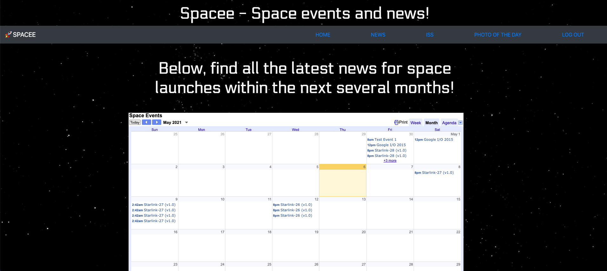

# Spacee- Space News and Events

## Authors: 
[Valerie Russell](https://github.com/vruss14)

[Brian Moore](https://github.com/bborumoore)

[Nishad Kurup](https://github.com/Nishadkurup)

[Claire Phillips](https://github.com/ClairePhillips51)

## Link To Application
Link to Heroku: [Spacee](https://space-e.herokuapp.com/)

## Table of Contents
1. [Summary](#summary)
2. [Installation](#installation)
3. [Application](#application)
4. [Contributions](#contributions)
5. [License](#license)
6. [Resources](#resources)

## Summary
Spacee is the place to find all the latest space news, space launches and events, where over the world the iss station is. The user can also view NASA's photo of the day. The user can also save specific events or the entire calendar to their own personal calendar. Sign-up or login to see the magic!

## Installation
For this application to run correctly, run npm init -y in the working directory of choice. Next, install the relevant dependencies by running npm i. Alternatively, dependencies can be installed one at a time. 

A .env file will need to be created and include a username, password, and database name for MySQL: The database will have to be created in the users own MySQL Workbench to ensure that the application runs properly.

To start the application from the command line after all installations have been complete, run the command npm run seed to seed data to the created database, then run npm start. Tools like Insomnia can be used to test all routes.

## Application
Spacee is a fully functioning website following the MVC(Model-View-Controller) paradigm. Spacee has a database and working server. The applicaton utilizes five APIs: The Google Calendar API, Where the ISS at API, SpaceX API, Snapi or Space News API, and NASA APOD "unoffical API". Bootstrap was used for styling and to assist in creating some elements in the handlebars.

On launch the user will see a custom loading page featuring the Spacee spaceship mascot. After the site loads the user is asked to either login or sign up. After getting authentication the user can view and access the full site. The homepage hosts the google calendar which lists SpaceX launches/events for the next six months. Links on the calendar are live and when clicked will take the user to more information about the event. User will also have the option to add any event to their personal calendar. 

The News tab hosts the Space News API with pictures and links to the 10 latest space articles from around the world. The ISS page hosts all the information about the International Space Station including where over the world the ISS is with a link to Google maps that will display the current location, daily summary reports, and a list of astronauts on the ISS. The Photo of the Day link takes you to NASA's image of the day. 

## Contributions
The space background used throughout the site was modified from:
[Nazarazhar.blogspot.com] (https://codepen.io/NazarTheVis/pen/zqXMqP) 
2016 by Nazar The Vis Azhar
"I just wanted to make people happy :)"

## License
This project has not yet been licensed, and thus, standard copyright laws apply.

## Resources
* [Google Calendar API](https://developers.google.com/calendar/overview)
* [ISS API](https://www.programmableweb.com/api/where-iss-rest-api)
* [NASA Photo of the Day](https://apod.nasa.gov/apod/astropix.html)
* [Space News API](https://thespacedevs.com/snapi) 
* [SpaceX API](https://github.com/r-spacex/SpaceX-API)